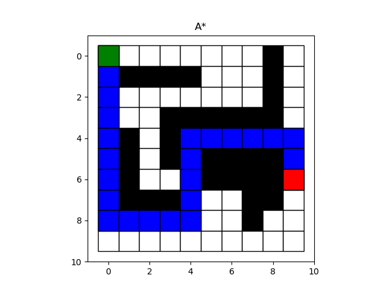
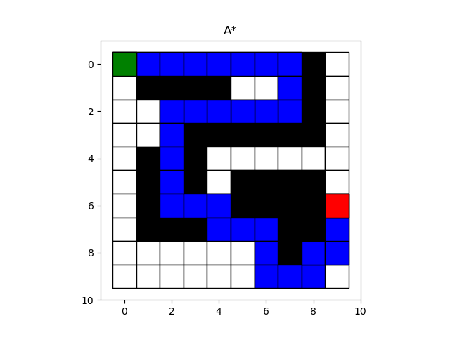

# RBE 550 - Basic Search Algorithms Implementation

## Overview

In this repo , you are going to implement **BFS**, **DFS**, **Dijkstra** and **A*** algorithms. These are the basic algorithms for discrete planning, which also share a lot of similarities.
Files included:

**search.py** file contains the functions for **BFS**, **DFS**, **Dijkstra** and **A*** algorithms.

**main.py** is the scrip that provides helper function **load_map** to load the map from csv files and visualize the map and path.

**map.csv** is the map file you could modify to create your own map.

**test_map.csv** restores a test map for doc test purpose only. Do not modify this file.

## Libraries used 
Following are the python libraries that have to be installed.

1. `matplotlib`

## Instructions

**NOTE:** When running **search.py** as a main function, it will run a doc test for all the algorithms. It loads **test_map.csv** as the map for testing.

For visualization, please run:

`python main.py`

There should be 4 maps shown representing the result of 4 algorithms. 

## Results

Below are results for Weighted A* agorithm

    
     

    
     

  