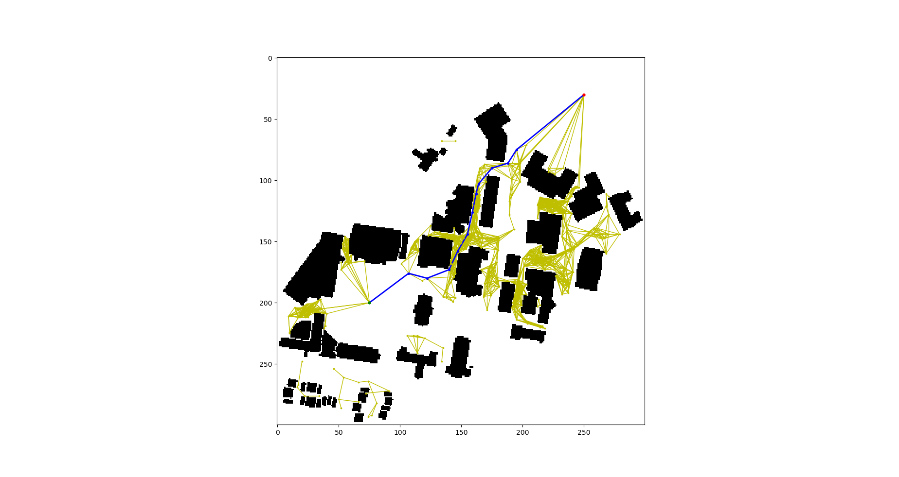
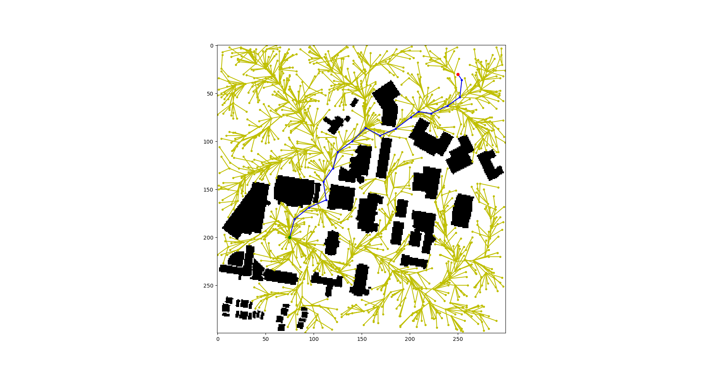
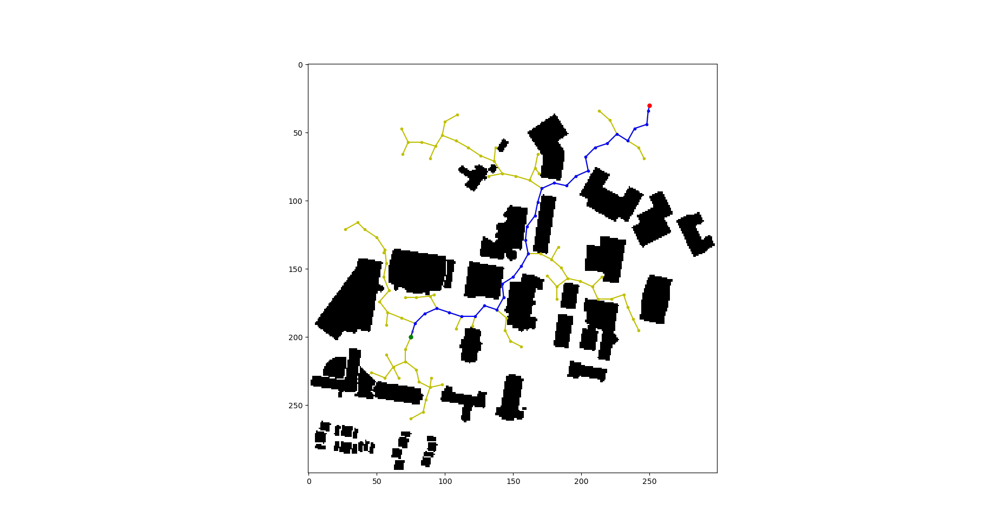

# Standard Search Algorithms Implementation

## Overview

In this repo, the implementation of **PRM**, **RRT** and **RRT*** algorithms can be found. For **PRM**, 4 different sampling methods - **uniform sampling**, **random sampling**, **gaussian sampling** and **bridge sampling** are implemented. These three algorithms are the basic ones for sampling-based planning. Use your own map in the form of **.jpg** or **.png** as an input and scale it according to the visualization requirements. 

Files included:

**PRM.py**  file contains the PRM class with four different sampling methods as mentioned above.

**RRT.py** file contains the RRT class with functions RRT and RRT*.

**main.py** is the scrip that provides helper function **load_map** to load the map from an image. Then executes the classes and functions from **PRM.py** and **RRT.py** over the generated map.

**WPI_map.jpg** is a binary WPI map image with school buildings. You could replace it with some other maps you prefer. Make sure the map image is in form of **.jpg** or **.png**.

**Note:** Please keep in mind that, the coordinate system used here is **[row, col]**, which is different from [x, y] in Cartesian coordinates. In README and the code comment, when the word '**point**' is used, it refers to a simple list [row, col]. When the word '**node**' or '**vertex**' is used, it refers to either the Node class in RRT ,or a node/vertex in a graph in PRM. 

## Libraries used 

matplotlib
numpy
Bresenham
scipy
Networkx

## Instructions

Run `python main.py`
After you finish coding, your algorithms should produce similar results as the images in **results** folder. Similar to the ones provided below.

## Results

    
     

    
     

    
     

<!--
### PRM

The two main phases of PRM are **Learning Phase** and **Query Phase**. 

You would code **Learning Phase** in the function `sample`, where it samples points in the map according to different strategy, and connect these points to build a graph. In this template, the graph library [Networkx](https://networkx.org/documentation/stable/) is used to store the result graph. 

There are four different sampling methods to be implemented - `uniform_sample`, `random_sample`, `gaussian_sample` and `bridge_sample`. Please refer to the lectures and make sure you understand the ideas behind these sampling methods before coding. 

After sampling, you would need to connect these sampling points to theirs k nearest neighbors. To find their neighbors, you could use brutal force algorithm or K-D tree as mentioned in the class. Here is an [example](https://stackoverflow.com/questions/13796782/networkx-random-geometric-graph-implementation-using-k-d-trees) of how to use scipy K-D tree structure. 

Finally, you will need to use all the sampled points and their connection with neighbors as nodes and edges to build a Networkx graph.

You would code **Query Phase** in the function `search`, where it search for a path in the constructed graph given a start and goal point.

As start and goal points are not connected to the graph, you will first need to add the start and goal node, find their nearest neighbors in the graph and connect them to these two nodes. Practically, as some of the graphs don't have a good connectivity, we will not only connect the start and goal node to their nearest node, but all the nodes within a certain distance, in order to increase the chance of finding a path.

Having connected start and goal node in the graph, we could use Dijkstra algorithm or any other algorithms we learn before to search for a valid path. This part is similar to the first assignment, so is already done by using the function Networkx provided.

Finally, as PRM is a multi-query planning algorithms, one could call `search` with other start and goal point. So the previous start and goal nodes and their edges need to be removed in the end of each query phase. This part is also implemented already.

Read the description of the functions for more details before implementing.

---

### RRT

For simplicity, this template uses a class 'Node' and a list 'vertices' in class 'RRT' as a tree structure. If you prefer to use other tree structure, please feel free to do so.

You would code RRT in the function `RRT`. In each step, get a new point, get its nearest node, extend the node and check collision to decide whether to add or drop this node. When you add a new node to the tree, remember to set the cost and parent of the new node, and add the new node to the list 'vertices'. You will also need to check if it reaches the neighbor region of the goal. If so, connect to the goal directly and set the found flag to be true.

You would code RRT* in the function `RRT_star`. The first few steps are pretty much the same as RRT. Besides, when a new node is added, you will need to rewire the new node and all its neighbor nodes. Even a path is found, the algorithm should not stop as adding new nodes will possibly optimize the current  found path.

Read the description of the functions for more details before implementing.

---

Until now, I hope you have a basic understanding of the template code and what to do next. 

As before, this template is only provided as a start point, feel free to make any modification of the codes or code structures if needed.

-->

